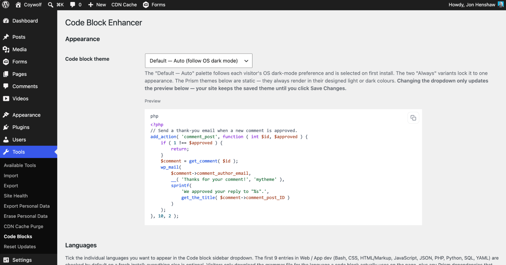
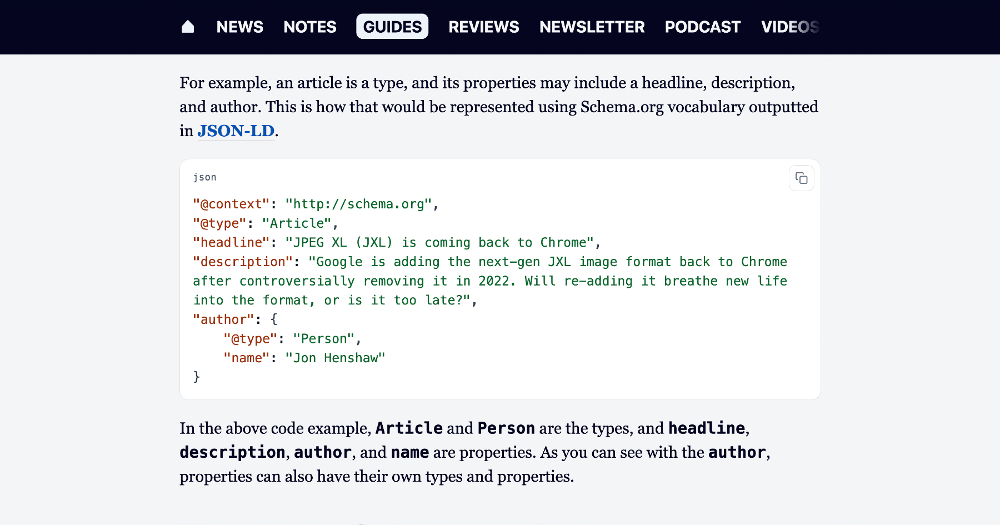

# Coywolf Code Block Enhancer

Adds syntax highlighting and a copy-to-clipboard button to the native WordPress Code block, plus a language picker in the editor sidebar. Assets load only on posts that actually contain a code block.

- **Version:** 1.0.53
- **Requires WordPress:** 6.3 or later
- **Tested up to:** 7.0
- **Requires PHP:** 7.4 or later
- **License:** [GPL-2.0-or-later](https://www.gnu.org/licenses/gpl-2.0.html)

## Description

Coywolf Code Block Enhancer extends the built-in `core/code` block. In the editor it adds a "Code language" dropdown to the block sidebar; on the front end it highlights the code with Prism.js using a custom token palette, prints the language name as a small label on the block, and pins a copy-to-clipboard button to the top-right corner.

- Adds a "Code language" dropdown to the core Code block's sidebar. A baseline of 9 languages (Bash, CSS, HTML/Markup, JavaScript, JSON, PHP, Python, SQL, YAML) is always loaded; an additional **40 grammars** can be toggled on via **Language packs** in Tools → Code Blocks (Web/App dev — TypeScript, JSX/TSX, SCSS, Sass, Less, GraphQL — is enabled by default).
- Highlights code on the front end with Prism.js. Pick from **45 bundled themes** — the 8 stock Prism themes (Prism Default, Coy, Dark, Funky, Okaidia, Solarized Light, Tomorrow Night, Twilight) plus 37 community themes from [PrismJS/prism-themes](https://github.com/PrismJS/prism-themes) (a11y Dark, Atom Dark, Dracula, Nord, One Dark, Night Owl, Synthwave '84, Gruvbox, Material, VS Code Dark+, and more) — or the bundled **Default** palette (selected on first install).
- Adds a small language label in the top-left of each highlighted block (only when a language is set).
- Adds an accessible copy-to-clipboard button — `aria-label`, a polite status region that announces "Copied to clipboard," and a visible "✓" state for two seconds after a successful copy. Falls back to `document.execCommand('copy')` on non-HTTPS or older browsers.
- Assets load only on singular posts/pages that contain a code block; Prism core and grammars are loaded with the `defer` strategy so they never block rendering.
- **Dark-mode aware** out of the box — with the bundled **Default — Auto** theme (selected on first install), code blocks follow each visitor's `prefers-color-scheme` automatically. Override from **Tools → Code Blocks** by switching to **Default — Always light** / **Always dark**, or by picking any of the static Prism themes.
- **Upload a custom theme.** Drop in a single `.css` file (up to 256 KB) and it shows up in the dropdown as a "Custom" option. The file is checked for unsafe content (script tags, PHP open tags, `javascript:` URIs, `expression()`, etc.) before being saved. Only one custom theme is stored at a time — uploading replaces, removing wipes.
- In-WordPress updates: new versions are pulled from this project's GitHub Releases through the standard **Dashboard → Updates** flow (latest release cached for 6 hours). Downloads are pinned to a GitHub host allowlist as a safety check.

### How it works

The chosen language is stored as a `language` block attribute on `core/code`, which lives in the block delimiter comment rather than the saved markup. That means blocks without a language stay valid and existing content is never migrated.

On render, the plugin uses `WP_HTML_Tag_Processor` to add `data-language` to the `<pre>` and `language-xxx` to the `<code>` server-side — so KSES won't strip `data-*` attributes for non-admin authors, and there is no block-validation churn.

Prism core and the per-language grammars are bundled under `assets/prism/` at v1.30.0 (MIT — see `assets/prism/LICENSE`). They register as deferred scripts with explicit dependency ordering (e.g. `markup-templating` before `php`, `clike` before languages that extend it). The copy-button script depends on the last grammar in the chain, so all of Prism is present before the copy UI is wired up. Reading `code.textContent` returns the original source even after Prism wraps tokens in spans, so the copied text is unaffected by highlighting.

Self-hosting Prism (rather than loading from a public CDN) keeps the third-party-script supply chain off the plugin's surface and means the plugin works on sites with strict CSPs or no external egress.

## Installation

1. Upload the `code-block-enhancer` folder to `/wp-content/plugins/`, or upload the .zip via **Plugins → Add New → Upload Plugin**.
2. Activate the plugin.
3. Edit a post or page, add (or open) a Code block, and pick a language from the "Code language" panel in the block sidebar. The code is highlighted on the front end and a copy button appears in the top-right of the block.

## Frequently Asked Questions

### Which languages are supported out of the box?

Bash/Shell, CSS, HTML/Markup, JavaScript, JSON, PHP, Python, SQL, and YAML. The dropdown also includes "None (plain text)" to render a block without highlighting.

### How do I add another language?

Open **Tools → Code Blocks → Language packs** and enable the pack that contains the language you need. The baseline 9 languages are always available; the other 40 grammars are grouped into packs you can toggle on. Anything you enable shows up in the Code block's "Code language" dropdown automatically — no code editing required.

### Will this break my existing code blocks?

No. The language is stored as a block attribute, not baked into the saved markup, so blocks without a language stay valid and the front-end language class is applied at render time. Existing content is not migrated and is unaffected.

### Does Prism load on every page?

No. The token CSS only enqueues on singular posts/pages where `has_block( 'core/code' )` is true, and the Prism scripts are only enqueued from inside the `render_block` filter for `core/code` — so a page with no code block ships none of these assets. Prism is also loaded with the `defer` strategy so it never blocks rendering.

### My site has a Content Security Policy. What do I need to allow?

Nothing extra. Prism and the copy-button script are bundled with the plugin and served from your own origin, so a `script-src 'self'` policy is enough. There is no external CDN call from the front end.

### How do I change the theme?

Go to **Tools → Code Blocks** in WP Admin. The **Code block theme** dropdown lists every bundled theme in three groups: **Coywolf** (Default — Auto / Always light / Always dark), **Prism (built-in)**, and **Prism Themes (community)**. Below the dropdown a live preview pane re-renders a sample PHP snippet in the highlighted theme on every change — your site keeps the previously saved theme until you click **Save Changes**. The selected theme's stylesheet is enqueued only on posts that contain a code block; only one theme file is ever loaded per request.

### How do I lock code blocks to light or dark mode for everyone?

If you're on the bundled **Default — Auto** theme (the first-install default), switch to **Default — Always light** or **Default — Always dark** in **Tools → Code Blocks**. Picking any of the Prism themes also locks the appearance — those themes are static and don't react to OS dark mode. The lock is implemented in CSS — there is no inline `<style>` injected per request — so it composes cleanly with caching plugins.

### Can I use my own theme?

Yes. Scroll past the dropdown on **Tools → Code Blocks** to the **Custom theme** section and upload a single `.css` file (up to 256 KB). It's added to the dropdown under a **Custom** group so you can select it like any other theme. Replacing the upload swaps the file in place; **Remove custom theme** deletes it. Only one custom theme is stored at a time — the plugin doesn't manage a library.

Security checks before the file is written:

- Capability (`manage_options`) and nonce checks on the form submission.
- Filename must end in `.css`; MIME validated via `wp_check_filetype_and_ext()`.
- Size capped at 256 KB.
- Content is rejected outright if it contains `<script>`, `<?php` / `<?=`, `javascript:` / `vbscript:` URIs, `data:text/html`, `expression(`, `behavior:`, or `-moz-binding:` anywhere in the file.
- File is written to `wp-content/uploads/code-block-enhancer/custom.css` (alongside your other media), not into the plugin directory — updating the plugin doesn't blow it away.

### Where do the Prism themes come from?

The 8 stock themes are bundled from [PrismJS/prism](https://github.com/PrismJS/prism) at v1.30.0 (MIT — see `assets/themes/LICENSE-prism`). The 37 community themes are bundled from [PrismJS/prism-themes](https://github.com/PrismJS/prism-themes) (MIT — see `assets/themes/LICENSE-prism-themes`). They are served from your own origin alongside the rest of the plugin's assets — no external request at runtime.

### Why is the language label not appearing on a particular block?

The label only renders when a language is set (the CSS rule is `.wp-block-code[data-language]::before`). If the block was created before the plugin was installed, open it in the editor and pick a language from the sidebar so the `language` attribute is saved.

### Where do plugin updates come from?

Releases are published to this plugin's [GitHub repository](https://github.com/coywolf-llc/coywolf-code-block-enhancer). The plugin checks GitHub Releases (cached for 6 hours) and offers any newer version through the standard WordPress **Dashboard → Updates** / "Update Now" flow. Downloads are restricted to a GitHub host allowlist as a safety check.

## Privacy

Privacy-first: this plugin includes no analytics, no tracking, and no data gathering. Nothing about you, your site, or your visitors is ever collected or sent anywhere.

## Screenshots

### Settings
The Code Block Enhancer settings screen in WordPress, showing the Appearance options with a code block theme dropdown set to "Default — Auto (follow OS dark mode)," a live preview of a syntax-highlighted PHP snippet, and a custom theme upload section.

### Front-end output
A syntax-highlighted JSON-LD code block rendered on the front end of a Coywolf Guides article, showing a Schema.org Article example with @context, @type, headline, description, and a nested author Person object.

## Changelog

### 1.0.53
- Security: the custom CSS theme check now also blocks `@import` and remote / protocol-relative `url()`, so an uploaded theme cannot fetch from or beacon to a third-party origin.
- Editor: the "Code language" sidebar control is now translatable (i18n).
- Accessibility: honor `prefers-reduced-motion`, raise the dark-mode language-label contrast to WCAG AA, and announce custom-theme admin notices to screen readers (`role="alert"`).
- Performance: memoize the custom-theme lookup so it is not re-read on every front-end request.
- Docs/build: strip the GitHub-updates FAQ from the WordPress.org build, and correct the upload-security and "add a language" docs.

### 1.0.52
- Render plugin screenshots in the GitHub readme (#53).

### 1.0.51
- Resolve remaining Plugin Check warnings (#52).

### 1.0.50
- Fix WordPress.org review issue: match text domain to the .org slug (#51).

### 1.0.49
- CI: upgrade actions to Node 24-native versions (#50).

### 1.0.48
- CI: run bundled JS actions on Node 24 (#49).

### 1.0.47
- Set distinct Plugin URI and Author URI (#48).

### 1.0.46
- Add WordPress.org screenshots + captions (#47).

### 1.0.45
- Fix readme Contributors/Tags header line (#46).

### 1.0.44
- Set readme Contributors to jonhenshaw (#45).

### 1.0.43
- Fix all WordPress.org Plugin Check errors (#44).

### 1.0.42
- Add WordPress.org variant build + gated SVN deploy (#43).

### 1.0.41
- Add Atom-feed fallback when the GitHub API is rate-limited (#42).

### 1.0.40
- Fix: don't block manual zip uploads (untrusted host error) (#41).

### 1.0.39
- Harden guard_pre_download: use hook_extra, fail closed (#40).

### 1.0.38
- Perf: honour _neg cache + cache wp_error failures in updater (#39).

### 1.0.37
- Perf: memoize the language registry (audit finding) (#38).

### 1.0.36
- Preload grammars at low priority (fetchpriority="low") (#37).

### 1.0.35
- Preload grammar scripts in <head> to break the critical request chain (#36).

### 1.0.34
- Default light palette: higher-contrast colors (WCAG AA / AAA) (#35).

### 1.0.33
- Bump Tested up to: 7.0 (#34).

### 1.0.32
- Settings: unsaved-changes guard with 3-button modal (#33).

### 1.0.31
- Settings: Custom theme into Appearance, Languages last (#32).

### 1.0.30
- Languages: Web/App dev is the new baseline pack (#31).

### 1.0.29
- Settings preview JS: replace innerHTML with DOM APIs (defense in depth) (#30).

### 1.0.28
- Per-language toggles + per-page lazy grammar enqueue (#29).

### 1.0.27
- Add Language packs setting — 5 togglable groups of 40 extra Prism grammars (#28).

### 1.0.26
- Update plugin description copy (#27).

### 1.0.25
- Test the v1.0.24 updater-flush refresh-current_version fix (#26).

### 1.0.24
- Updater: refresh current_version after upgrade (fix the double-update prompt) (#25).

### 1.0.23
- Test the v1.0.22 updater-flush fix (#24).

### 1.0.22
- Updater: clear update_plugins transient after self-update (#23).

### 1.0.21
- Fix: stray ?> leaked PHP source into the settings preview (#22).

### 1.0.20
- Custom upload: drop strict MIME sniff (rejected valid CSS files) (#21).

### 1.0.19
- Preview: fix Default light stripes; add side padding (#20).

### 1.0.18
- Settings: download link, custom theme name, Save at bottom, auto-activate (#19).

### 1.0.17
- Default theme: continuous background; preview alignment (#18).

### 1.0.16
- Rename Coywolf theme to default.css; add custom-theme upload (#17).

### 1.0.15
- Default theme: set bg to #ffffff (light) and #050520 (dark) (#16).

### 1.0.14
- Rename Prism 'Default' → 'Prism Default'; rename Claude → Default (#15).

### 1.0.13
- Live theme preview on the Tools → Code Blocks settings page (#14).

### 1.0.12
- Rename bundled palette label from 'Coywolf Claude' to 'Claude' (#13).

### 1.0.11
- Bundle all 45 Prism themes; theme picker on settings page (#12).

### 1.0.10
- Auto dark mode + Tools settings page for theme override (#11).

### 1.0.9
- No-op release to verify the plugin icon shows on the Updates row once the site is running an icon-aware updater (1.0.8+).

### 1.0.8
- Show plugin icon on Updates / Plugins / View-details (#9).

### 1.0.7
- Self-host Prism and allowlist the language attribute (security) (#8).

### 1.0.6
- Add coywolf logo to .wordpress-org/ and readme.md (#7).

### 1.0.5
- Mirror readme.md as a peer to readme.txt; dual-bump in release workflow (#6).

### 1.0.4
- Rename plugin title to 'Coywolf Code Block Enhancer' (#5).

### 1.0.3
- Mirror readme.txt into README.md for GitHub rendering (#4).

### 1.0.2
- Rewrite readme.txt in coywolf-link-checker format (#3).

### 1.0.1
- Add GitHub updater, uninstall cleanup, expanded readme (#2).

### 1.0.0
- Initial release.

